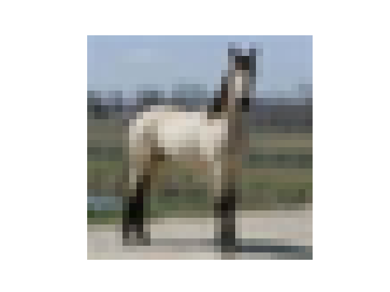
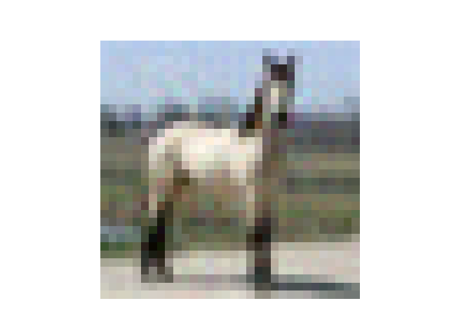

# E-GAP: Evolutionary Gradient Attack on Privacy
> Published as a journal paper in Computers and Electrical Engineering.

Vulnerabilities such as optimization-based gradient attacks have demonstrated the potential to reconstruct raw data from shared updates, exposing critical privacy risks and questioning the robustness of FL frameworks. In this work, we propose a privacy attack referred to as Evolutionary Gradient Attack on Privacy (E-GAP), an enhancement of the Recursive Gradient Attack on Privacy (R-GAP), which integrates Differential Evolution (DE). For more details and background on this topic please refer to the paper. 

## Download

```sh
git clone https://github.com/yuvrajchaudhry/egap.git
cd egap
python3 -m venv env
source env/bin/activate
pip install -r requirements.txt
```

## Usage example
> The reconstructed images will be saved in the `Reconstructed` folder, DE objectives and runtime log will be saved in the `Plots` folder.

* Reconsturction of a random image:
```
python main.py
```

* Reconstruction of a particular image with a specific image number, model or dataset:
```
python main.py -i 00 -m abc -d abc
```
Parameter `i` is for image number, `m` is for the model, `d` is for the dataset.

* Example
```
python main.py -i 25 -m MNIST -d FCN3
```

* Reconstruction of batch images (Replace "x" by batch size, eg. 2. Please ensure that the size does not exceed the number of your cpu cores.):
```
python main.py -b x
```

* To compare and get the SSIM score of images, place the images in the `images_compare` folder and edit the image names in the `ssim.py` file.
```
python ssim.py
```

<table align="center" style="border: 2px solid white; border-collapse: collapse;">
  <tr>
    <th style="border: 2px solid white; padding: 8px;">Original</th>
    <th style="border: 2px solid white; padding: 8px;">Reconstructed</th>
    <th style="border: 2px solid white; padding: 8px;">Rescaled Reconstructed</th>
  </tr>
  <tr>
    <td style="border: 2px solid white; padding: 8px;">
      
    </td>
    <td style="border: 2px solid white; padding: 8px;">
      
    </td>
    <td style="border: 2px solid white; padding: 8px;">
      
    </td>
  </tr>
</table>


<!--- 
## Citation 
```
@article{
yuvraj25egap,
author = {Yuvraj Singh Chaudhry and Rammohan Mallipeddi},
title = {E-GAP: Evolutionary Gradient Attack on Privacy},
journal = {Computers and Electrical Engineering},
volume = {11},
number = {11},
pages = {11}
year = {2025},
url = {https://}
}
```
-->

<h1 align="center">Thank you!</h1>
